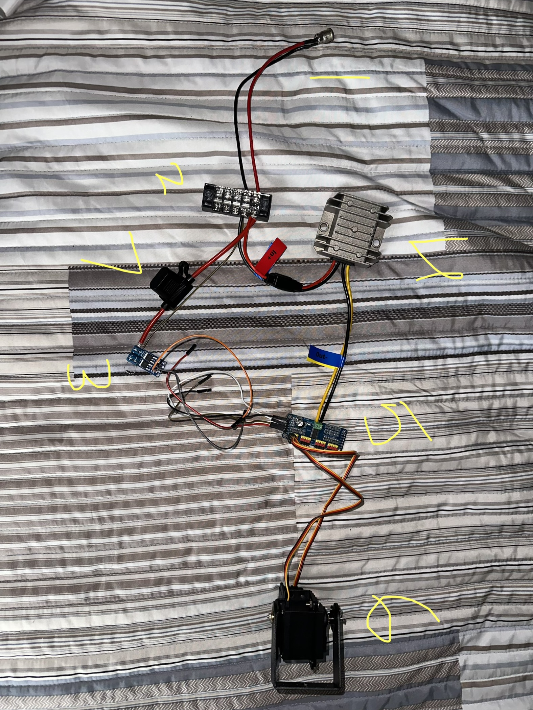

# Parts List

Treat the part name/spec as the source of truth, since listings can go out of stock or get relisted.

1. DC jack
2. Terminal block
3. MOSFET trigger module (pump, flyback diode built in)
4. Buck converter
5. PCA9685 servo driver
6. Servo (MG996R)
7. Fuse holder (5A)

## Compute & Storage

| Part | Spec | Qty |
|---|---|---|
| Raspberry Pi 5 | 4GB RAM | 1 |
| Active Cooler | Official Raspberry Pi | 1 |
| microSDXC card | 64GB, A2, up to 200MB/s | 1 |
| USB-C power supply | Official Pi 5-rated | 1 |
| USB webcam | 1080p HD | 1 |

## Aiming (Pan/Tilt)

| Part | Spec | Qty |
|---|---|---|
| Servo | MG996R, 55g high-torque metal gear | 2 |
| Pan-tilt bracket | 2 DOF servo mount kit | 1 |
| Servo driver | PCA9685, 16-channel 12-bit PWM/I2C | 1 |

## Water System

| Part | Spec | Qty |
|---|---|---|
| Pump | Bayite BYT-7A108, 12V DC diaphragm, 5A draw, 80-85 PSI cutoff, 1.2 GPM | 1 |
| Nozzle | Adjustable spray nozzle with tip | 1-2 |
| Barb fitting | Brass, 3/8" barb to 3/8" MPT (adapts pump/tubing to nozzle thread) | 1 |
| Tubing | Silicone, 3/8" ID x 1/2" OD, food-grade | 10ft |
| Reservoir | DIY made with sealed jug with intake tubing and air vent (see notes below) |1 |
| Inline mesh strainer | DIY nylon mesh strainer | 1 |

## Power & Switching

| Part | Spec | Qty |
|---|---|---|
| Main power supply | 12V 5A AC-to-DC adapter, 5.5x2.1mm barrel | 1 |
| Buck converter | 12V/24V → 6V, 10A, waterproof | 1 |
| MOSFET trigger module | Dual-MOSFET (AOD4184-based), 3.3-20V logic trigger, 15A/30A, 5-36V | 1 |
| Flyback diode | 1N4007, 1A/1000V (across pump terminals) | 1 |
| Fuse holder | 12AWG inline, waterproof | 1 |
| Fuse | 5A blade (matched to pump's rated draw) | 1 |
| DC power jack | 5.5x2.1mm, threaded panel-mount | 1 |
| Terminal block | Screw-type barrier strips | as needed |
| Jumper wires | DuPont, M-M / M-F / F-F assortment | as needed |

## Reservoir notes
The intake tube passes through a hole melted or drilled in the jug's cap, sealed with hot glue or silicone caulk to prevent air leaking in alongside the water this pump is suction-fed. The jug is left otherwise unsealed or vented with a second small hole so air can replace the water leaving.

## Tools used (not part of the installed build)
Digital multimeter, soldering iron kit, wire strippers, small screwdriver set, breadboard, safety glasses, wire crimpers/terminal block (for splicing).
