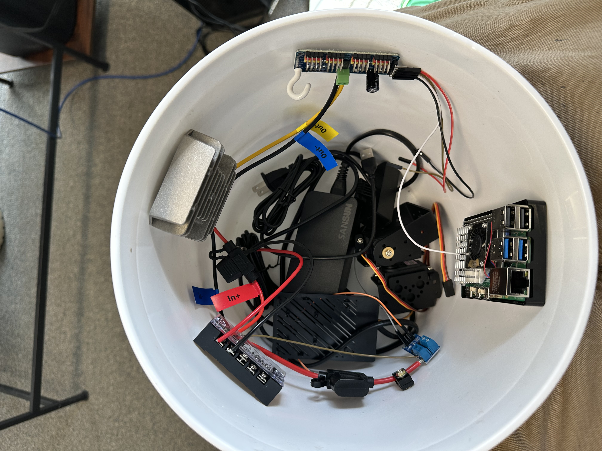

# Wiring

Three separate power rails, one shared ground. Nothing crosses rails except through the buck converter (12V → 6V) and the MOSFET switching the pump.

## Power Rails

| Rail | Source | Powers | Notes |
|---|---|---|---|
| **A — Pi power** | USB-C PSU | Raspberry Pi 5, camera (via USB) | Independent — never share with servo/pump loads |
| **B — Servo power** | 12V supply → buck converter → 6V | PCA9685 **V+** terminal → both servos | 6V, 10A converter — do NOT feed 12V into V+ directly |
| **C — Pump power** | 12V supply → fuse → MOSFET module | Pump | Fused, switched by MOSFET, flyback diode across pump terminals |

All three share a common ground — different voltages, same ground reference, which is what lets the Pi's 3.3V GPIO signal reliably switch a 12V load.

## Physical layout



## Overview

```text
                         ┌─────────────────────────┐
                         │   12V Power Supply      │
                         └────────────┬────────────┘
                                      │
                    (into enclosure via panel-mount jack)
                                      │
                                      |
                                Terminal Block
                                      |
              ┌───────────────────────┼───────────────────────┐
              ▼                                               ▼
   ┌─────────────────────┐                         ┌─────────────────────┐
   │  Buck Converter     │                         │  Fuse Holder (5A)   │
   │  12V → 6V, 10A      │                         └──────────┬──────────┘
   └──────────┬──────────┘                                    ▼
              │                                      ┌─────────────────────┐
              ▼                                      │  MOSFET Trigger     │
   ┌─────────────────────┐                           │ Module (dual-MOSFET)│
   │  PCA9685 "V+"       │◄── servo power only       └──────────┬──────────┘
   │                     │                                      │
   └──────────┬──────────┘                             ┌────────┴────────┐
              │                                        ▼                 │
     ┌────────┴────────┐                        ┌────────────────┐       │
     ▼                 ▼                        │  12V Diaphragm │       │
┌─────────┐      ┌─────────┐                    │  Pump          │◄──────┘
│ Pan     │      │ Tilt    │                    └────────┬───────┘
│ Servo   │      │ Servo   │                             │
│(MG996R) │      │(MG996R) │                    1N4007 flyback diode
└─────────┘      └─────────┘                    across pump terminals


┌───────────────────────┐        I2C (SDA/SCL)       ┌─────────────────────┐
│   Raspberry Pi 5      │◄──────────────────────────►│   PCA9685 Driver    │
│                       │                            |  (logic side, VCC)  │
│  [USB-C PSU — Rail A] │      GPIO 17 Signal        └──────────┬──────────┘
│                       │───────────────────────────────────────┘
│   [USB Webcam]        │        (to MOSFET module's J1 trigger pin)
└────────────┬──────────┘
             │
        ═════╧══════════════════════════════════════ COMMON GROUND ══════
        (Pi GND, PCA9685 GND, buck converter GND, fuse/MOSFET/pump GND —
         all tied together, even though supply voltages differ)
```

## Connection Reference

### Pi ↔ PCA9685 (I2C — logic only, no servo power here)

| Pi physical pin | Label | → | PCA9685 pin |
|---|---|---|---|
| 1 | 3.3V PWR | → | VCC |
| 6 (or any GND) | GND | → | GND |
| 3 | I2C1 SDA | → | SDA |
| 5 | I2C1 SCL | → | SCL |

### PCA9685 ↔ Servos

| PCA9685 channel | Servo |
|---|---|
| 0 | Pan (MG996R) |
| 1 | Tilt (MG996R) |

Servo **V+** comes from the buck converter's 6V output — never from the Pi, never from the 12V line directly.

### Pi ↔ MOSFET Trigger Module

| Pi | → | MOSFET module (soldered J1 header) |
|---|---|---|
| GPIO 17 | → | TRIG/PWM |
| Any GND | → | GND |

### 12V Line ↔ Pump Circuit

```
12V supply (+) → panel-mount DC jack → fuse holder (5A) → MOSFET VIN+
MOSFET OUT+ → pump (+)
12V supply GND → MOSFET VIN- → common ground
Pump (−) → common ground
1N4007 diode: cathode → OUT+/pump(+), anode → OUT-/pump(−)  [reverse-biased in normal operation]
```

### 12V Line ↔ Buck Converter ↔ Servo Rail

```
12V supply (+) → buck converter In+
12V supply GND → buck converter In-
buck converter Out+ (6V) → PCA9685 V+ terminal
buck converter Out- → PCA9685 GND terminal (ties into common ground)
```

## Before Powering On — Checklist

- [ ] Pi is powered OFF while making or changing any wiring
- [ ] Multimeter-check the buck converter's output reads ~6V before connecting it to the PCA9685
- [ ] Fuse is rated ~5A (matches the pump's rated draw), not a higher default
- [ ] Flyback diode oriented correctly (cathode/banded end toward pump +)
- [ ] All grounds — Pi, PCA9685, buck converter, MOSFET module, pump — tied to one common ground
- [ ] `i2cdetect -y 1` shows `0x40` before running any servo code
- [ ] Power-on order: 12V supply first, then the Pi
